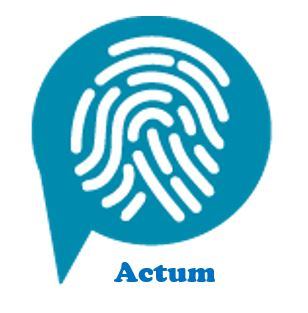
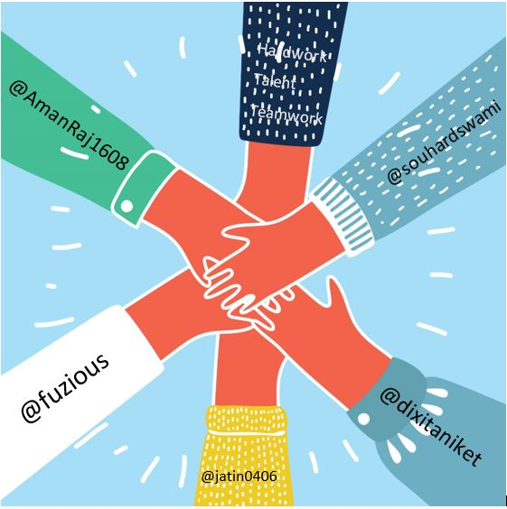

<h1 align="center">Actum</h1>

  

<b>Because Action speaks louder than Words</b>

### Motive

For actions to speak louder than words Actum has been designed to enhance the communication between normal and specially abled (deaf and dumb).

### Why Actum?

Actum is the complete solution to ease communication between normal and especially abled person viz. deaf and dumb. Using it anyone can easily recognize gestures produced by the deaf and dumb. Now speech will no more be a restriction to interact with someone. Using it the deaf and dumb can also easily interact with someone who don’t recognize their action, so that speech is no longer a restriction for them to express their feelings. Actum also has a chat app which the deaf and dumb can use to interact with others just by their gestures.

### Technologies

- Django
- Image Processing
- Image classfication using classifier

## Modus Operandi

Actum has a ML script running in the Django backend which will detect the gestures performed by any deaf or dumb which can be then mapped to a particular action which will be unique to that gesture.Then this gesture is passed by the backend to frontend where the text is displayed.  

### Contributors

	
Team Vision

		<ul>
			<li><a href="https://github.com/amanraj1608">Aman Raj</a></li>
			<li><a href="https://github.com/dixitaniket">Aniket Dixit</a></li>
		  <li><a href="https://github.com/fuzious">Arpit Srivastava</a></li>
			<li><a href="https://github.com/">Jatin Singh Chauhan</a></li>
      <li><a href="https://github.com/">Souhard Swami</a></li>
		</ul>

### References

- [Model Retraining and Transfer Learning](https://www.tensorflow.org/tutorials/image_retraining)
